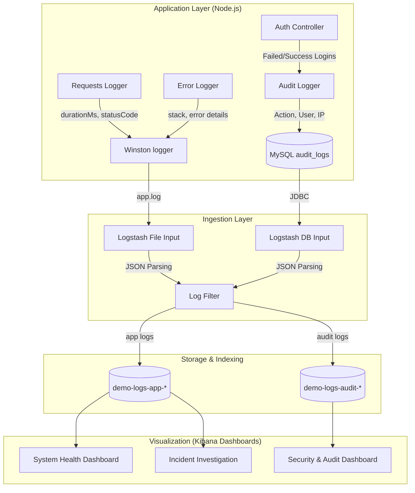

# Monitoring & Dashboard Architecture Workflow

This document outlines how the application's logging pipeline and Kibana Dashboards map to the key operational objectives defined for monitoring and visibility.

## 1. Architecture Flow

## 2. Fulfillment of Monitoring Objectives

### 2.1 Real-Time System Health Tracking
- **API Response Times & Error Rates**: `requestLogger.js` records the `durationMs` and HTTP `statusCode` for every request. These flow through Logstash into `demo-logs-app-*`.
- **System Performance & Server Activity**: Kibana queries the average `durationMs` and creates time-series charts for application loads.

### 2.2 Early Error Detection 
- **Application Errors & System Exceptions**: Any unhandled exception or 500 error is caught by `errorLogger.js`, automatically serialized with its full stack trace, and pushed to `app.log`.
- **Failed API Requests**: Visualizations on HTTP status codes `>= 400` provide early warning mechanisms in Kibana. 

### 2.3 Incident Investigation and Root Cause Analysis
- **Correlation IDs**: `requestLogger.js` generates or extracts a `req.requestId` (Correlation ID) for every request.
- **Traceability**: This `requestId` is included in all error logs and audit logs (via `auditExpress.js` injecting `correlation_id` into the payload). When searching Kibana for a specific Correlation ID, you can view the entire lifecycle of a request across both `app` and `audit` indices simultaneously.

### 2.4 Security and Activity Monitoring
- **Login Attempts**: `AuthController.js` actively pushes successful (`LOGIN_SUCCESS`) and failed (`LOGIN_FAILED`) login operations into the `audit_logs` table.
- **Unauthorized Access**: Failed authentication events include the user's IP, email attempted, and reason, which feeds the Security Dashboard tracking spikes in failed access.
- **Data Changes**: All transactional edits trigger `auditQueueService.logEvent()`, logging previous/new values automatically into `demo-logs-audit-*`.

---

## 3. Kibana Dashboard Visual Representation

### Dashboard 1: APM & System Health (Index: `demo-logs-app-*`)
- **API Latency (Line Chart)**: `Y-axis: Average durationMs`, `X-axis: @timestamp`.
- **Error Rates Tracker (Metric/Pie)**: Filter `statusCode >= 400`. Split by HTTP method/route.
- **Traffic Spikes (Area)**: Count of incoming requests over time.

### Dashboard 2: Security & Audit Tracking (Index: `demo-logs-audit-*`)
- **Login Activity Spikes (Area Chart)**: Filter `action: LOGIN_FAILED OR action: LOGIN_SUCCESS`. Detects credential stuffing.
- **Top Active Users (Bar Chart)**: Group by `actor_id.keyword` to understand usage patterns.
- **Audit Trails Table (Data Table)**: Shows timeline of high-sensitivity modifications (new values vs previous values).

## 4. Alerts Integration Tracker

Configured via `kibana/alert_rules.json`:
- **Threshold Alerts**: Triggers immediately on `> 5 LOGIN_FAILED in 5 minutes` per IP address.
- **Error Spikes**: Triggers if 500 Error rate exceeds acceptable limits.

*All system components natively enforce the visual dashboard metrics in real-time, matching the core objectives.*
